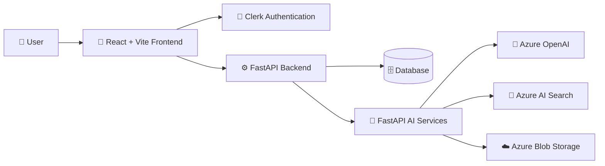

<div align="center">

# ✈️ Miles

### Your AI Travel Companion

<p>
  Plan personalized trips, generate intelligent itineraries,<br/>
  discover new destinations, and manage your journey with AI.
</p>

<br/>


<br/>


<br/><br/>

<p>
  Built with React, FastAPI, Microsoft Azure, and AI.
</p>

</div>

---

## 🚀 Overview

Miles is a full-stack AI travel planning platform designed to help users create, manage, and improve personalized trips.

It combines a modern React frontend, a FastAPI backend, and a separate FastAPI AI service to provide itinerary generation, contextual chat, personalized recommendations, trip management, and cloud-powered travel experiences.

| Area           | Purpose                                                                |
| -------------- | ---------------------------------------------------------------------- |
| 🎨 Frontend    | Trip planning, discovery, itinerary management, and user interaction   |
| ⚙️ Backend     | Authentication, persistence, business logic, and API coordination      |
| 🤖 AI Services | Itinerary generation, chat, retrieval, embeddings, and recommendations |
| 🗄️ Database   | Users, trips, preferences, itineraries, activities, and conversations  |
| ☁️ Azure       | AI models, search, storage, hosting, and deployment                    |
| 🔐 Clerk       | Authentication and identity management                                 |

---

## ✨ Features

| Feature                         | Description                                                                    |
| ------------------------------- | ------------------------------------------------------------------------------ |
| 🧳 Trip Planning                | Create trips using destination, dates, travelers, budget, interests, and notes |
| 🤖 AI Itineraries               | Generate personalized multi-day travel itineraries                             |
| 🔄 Smart Regeneration           | Regenerate full itineraries, specific days, or individual activities           |
| 🗓️ Activity Management         | Add, edit, delete, and reorder itinerary activities                            |
| 🌍 Discover                     | Browse destinations, restaurants, and activity recommendations                 |
| 🧠 Personalized Recommendations | Rank travel options using interests, budget, season, and travel style          |
| 💾 Saved Trips                  | Store and manage previously created trips                                      |
| 💬 Milo Assistant               | Chat with an AI assistant using travel and conversation context                |
| 🔐 Secure Accounts              | Protected frontend routes and authenticated API requests                       |
| ☁️ Cloud Integration            | Azure OpenAI, AI Search, Blob Storage, App Service, and Static Web Apps        |

---

## 🏗️ System Architecture



### Application Flow

```text
User
  │
  ▼
React + TypeScript Frontend
  │
  ├── Clerk Authentication
  │
  ▼
FastAPI Backend
  │
  ├── SQLAlchemy / Alembic
  │        │
  │        ▼
  │     Database
  │
  └── FastAPI AI Services
           │
           ├── Azure OpenAI
           ├── Azure AI Search
           └── Azure Blob Storage
```

---

## 🎨 Frontend

Location:

```text
/frontend
```

The frontend provides the main user experience for planning trips, discovering recommendations, managing saved trips, viewing itineraries, and interacting with Milo.

| Technology      | Usage                                    |
| --------------- | ---------------------------------------- |
| React 19        | User interface                           |
| TypeScript      | Type-safe frontend development           |
| Vite            | Development server and production builds |
| React Router    | Client-side routing                      |
| MUI             | UI components                            |
| Griffel         | Styling                                  |
| Axios           | Backend API communication                |
| i18next         | Internationalization                     |
| Clerk React SDK | Authentication                           |

### Main Routes

| Route                     | Description        | Access    |
| ------------------------- | ------------------ | --------- |
| `/`                       | Home page          | Public    |
| `/discover`               | Travel discovery   | Public    |
| `/plan-trip`              | Trip planning      | Protected |
| `/trips`                  | Saved trips        | Protected |
| `/itinerary`              | Itinerary          | Protected |
| `/itinerary/:itineraryId` | Specific itinerary | Protected |
| `/sign-in`                | Sign in            | Public    |
| `/sign-up`                | Sign up            | Public    |

Authenticated requests include the current Clerk session token when communicating with protected backend endpoints.

---

## ⚙️ Backend

Location:

```text
/backend
```

The primary backend is a FastAPI application responsible for application APIs, authentication validation, database operations, business logic, and communication with the AI service.

| Area                | Implementation                      |
| ------------------- | ----------------------------------- |
| API Framework       | FastAPI                             |
| ORM                 | SQLAlchemy                          |
| Database Migrations | Alembic                             |
| Validation          | Pydantic                            |
| Authentication      | Clerk JWT verification              |
| Webhooks            | Clerk user synchronization          |
| AI Communication    | HTTP communication with AI Services |
| Authorization       | User-scoped resource access         |

Application entry point:

```text
backend/app/main.py
```

---

## 🤖 AI Services

Location:

```text
/aiServices
```

Miles runs AI functionality as a separate FastAPI service.

Separating the AI layer from the main backend keeps AI generation, retrieval, embeddings, and recommendation processing independent from the primary application APIs.

| Capability                | Technology         |
| ------------------------- | ------------------ |
| Itinerary Generation      | Azure OpenAI       |
| Itinerary Regeneration    | Azure OpenAI       |
| AI Chat                   | Azure OpenAI       |
| Embeddings                | Azure OpenAI       |
| Retrieval                 | Azure AI Search    |
| Recommendation Data       | Azure Blob Storage |
| Recommendation Processing | pandas and NumPy   |

AI service entry point:

```text
aiServices/app/main.py
```

---

## 🧠 Recommendation System

Miles provides recommendation functionality for destinations, activities, and restaurants.

Recommendation datasets are stored as CSV files in Azure Blob Storage.

The AI service loads and processes the datasets using pandas and NumPy.

Recommendation scoring uses available trip and user information such as:

```text
Interests
Budget
Travel month / season
Travel style
```

The resulting scores are used to rank relevant travel options before returning them to the application.

---

## 🗄️ Database

The backend uses SQLAlchemy for persistence and Alembic for database migrations.

### Core Entities

| Entity             | Purpose                                               |
| ------------------ | ----------------------------------------------------- |
| `users`            | Local account connected to a Clerk user               |
| `trips`            | Trip details, dates, budget, travelers, and notes     |
| `interests`        | Available interest categories                         |
| `trip_interests`   | Many-to-many relationship between trips and interests |
| `trip_preferences` | Preferences associated with a trip                    |
| `itineraries`      | Generated itinerary versions                          |
| `itinerary_days`   | Individual itinerary days                             |
| `activities`       | Activities contained in itinerary days                |
| `conversations`    | Milo conversation sessions                            |
| `messages`         | Conversation history                                  |

Database migrations are stored in:

```text
backend/alembic/versions/
```

---

## 🔐 Authentication

Miles uses Clerk for authentication and identity management.


The frontend retrieves the current Clerk session token and attaches it to protected API requests.

The backend validates Clerk JWTs using Clerk JWKS and resolves the corresponding local user through the authentication provider ID.

### Clerk Webhook

```http
POST /webhooks/clerk
```

The webhook synchronizes local user records when Clerk users are created, updated, or deleted.

---

## ☁️ Azure Services

| Azure Service         | Usage                                                    |
| --------------------- | -------------------------------------------------------- |
| Azure OpenAI          | Chat, itinerary generation, regeneration, and embeddings |
| Azure AI Search       | Retrieval and search for AI flows                        |
| Azure Blob Storage    | Recommendation datasets                                  |
| Azure App Service     | Backend and AI service hosting                           |
| Azure Static Web Apps | Frontend hosting                                         |
| Azure Pipelines       | Validation and deployment                                |

---

## 🔌 Backend API

| Method                        | Endpoint                       | Purpose                     |
| ----------------------------- | ------------------------------ | --------------------------- |
| `GET`                         | `/health`                      | Service health check        |
| `GET`                         | `/test-db`                     | Database connectivity check |
| `POST`                        | `/webhooks/clerk`              | Clerk user synchronization  |
| `GET`                         | `/users/me`                    | Current authenticated user  |
| `CRUD`                        | `/trips`                       | Trip management             |
| `POST / GET / DELETE`         | `/trips/{trip_id}/interests`   | Trip interest management    |
| `POST / GET / PATCH / DELETE` | `/trips/{trip_id}/preferences` | Trip preference management  |
| `GET / POST`                  | `/itinerary`                   | Retriev                     |
