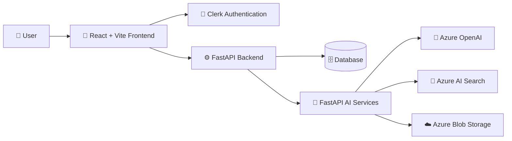
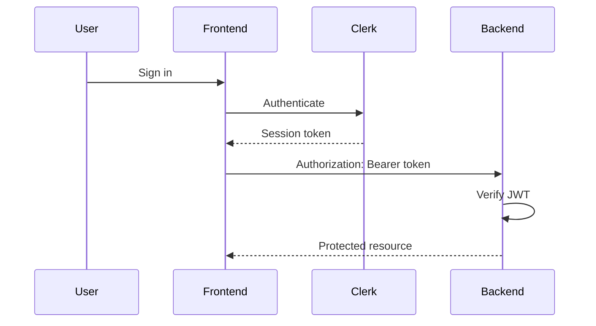
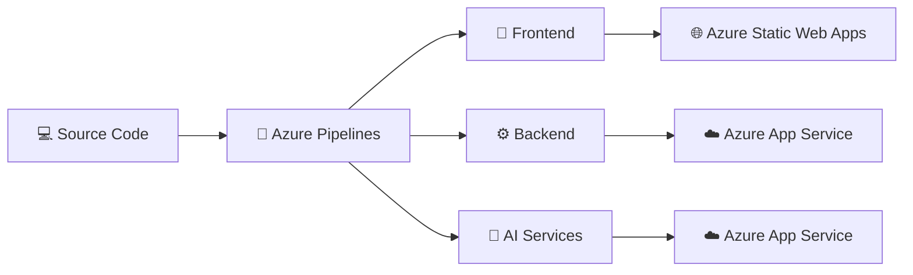

<div align="center">

# ✈️ Miles

### AI-powered travel planning, recommendations, and itinerary management

Plan smarter trips, generate personalized itineraries, discover destinations, and manage your entire journey in one place.

<br />


</div>

---

## 🚀 Overview

Miles is a full-stack AI travel planning platform designed to help users create, manage, and improve personalized trips.

The platform combines a React frontend, a FastAPI backend, and a separate FastAPI AI service to provide itinerary generation, contextual chat, travel recommendations, trip management, and cloud-backed data processing.

| Area           | Purpose                                                                |
| -------------- | ---------------------------------------------------------------------- |
| 🎨 Frontend    | Trip planning, discovery, itinerary management, and user interaction   |
| ⚙️ Backend     | Authentication, persistence, business logic, and API coordination      |
| 🤖 AI Services | Itinerary generation, chat, retrieval, embeddings, and recommendations |
| 🗄️ Database   | Trips, users, preferences, itineraries, activities, and conversations  |
| ☁️ Azure       | AI models, search, data storage, hosting, and deployment               |
| 🔐 Clerk       | User authentication and identity management                            |

---

## ✨ Features

| Feature                         | Description                                                                    |
| ------------------------------- | ------------------------------------------------------------------------------ |
| 🧳 Trip Planning                | Create trips using destination, dates, travelers, budget, interests, and notes |
| 🤖 AI Itineraries               | Generate personalized multi-day itineraries                                    |
| 🔄 Smart Regeneration           | Regenerate complete itineraries, individual days, or individual activities     |
| 🗓️ Activity Management         | Add, edit, delete, and reorder itinerary activities                            |
| 🌍 Discover                     | Browse destination, restaurant, and activity recommendations                   |
| 🧠 Personalized Recommendations | Rank travel options based on interests, budget, season, and travel style       |
| 💾 Saved Trips                  | Store and manage previously created trips                                      |
| 💬 Milo Assistant               | Chat with an AI assistant using travel and conversation context                |
| 🔐 Secure Accounts              | Protected routes and authenticated API requests using Clerk                    |
| ☁️ Cloud Integration            | Azure OpenAI, AI Search, Blob Storage, App Service, and Static Web Apps        |

---

## 🏗️ System Architecture



### Application flow

```text
User
  │
  ▼
React + TypeScript Frontend
  │
  ├── Clerk Authentication
  │
  ▼
FastAPI Backend
  │
  ├── SQLAlchemy / Alembic
  │        │
  │        ▼
  │     Database
  │
  └── FastAPI AI Services
           │
           ├── Azure OpenAI
           ├── Azure AI Search
           └── Azure Blob Storage
```

---

## 🎨 Frontend

Location:

```text
/frontend
```

The frontend is responsible for the main user experience.

| Technology      | Usage                             |
| --------------- | --------------------------------- |
| React 19        | UI development                    |
| TypeScript      | Type-safe frontend code           |
| Vite            | Development and production builds |
| React Router    | Client-side routing               |
| MUI             | UI components                     |
| Griffel         | Styling                           |
| Axios           | Backend API communication         |
| i18next         | Internationalization              |
| Clerk React SDK | Authentication                    |

### Main routes

| Route                     | Description        | Authentication |
| ------------------------- | ------------------ | -------------- |
| `/`                       | Home page          | Public         |
| `/discover`               | Travel discovery   | Public         |
| `/plan-trip`              | Trip planning      | Protected      |
| `/trips`                  | Saved trips        | Protected      |
| `/itinerary`              | Itinerary          | Protected      |
| `/itinerary/:itineraryId` | Specific itinerary | Protected      |
| `/sign-in`                | Sign in            | Public         |
| `/sign-up`                | Sign up            | Public         |

Authenticated requests automatically include the current Clerk session token when communicating with the backend.

---

## ⚙️ Backend

Location:

```text
/backend
```

The primary backend is a FastAPI application responsible for application APIs, authentication validation, database operations, and communication with the AI service.

### Responsibilities

| Area                | Implementation               |
| ------------------- | ---------------------------- |
| API Framework       | FastAPI                      |
| ORM                 | SQLAlchemy                   |
| Database Migrations | Alembic                      |
| Validation          | Pydantic                     |
| Authentication      | Clerk JWT verification       |
| Webhooks            | Clerk user synchronization   |
| AI Communication    | HTTP requests to AI Services |
| Authorization       | User-scoped resource access  |

The application entry point is:

```text
backend/app/main.py
```

---

## 🤖 AI Services

Location:

```text
/aiServices
```

Miles runs AI functionality as a separate FastAPI service.

This keeps AI workloads separate from the primary application backend.

### AI capabilities

| Capability                | Technology         |
| ------------------------- | ------------------ |
| Itinerary Generation      | Azure OpenAI       |
| Itinerary Regeneration    | Azure OpenAI       |
| AI Chat                   | Azure OpenAI       |
| Embeddings                | Azure OpenAI       |
| Retrieval                 | Azure AI Search    |
| Recommendation Data       | Azure Blob Storage |
| Recommendation Processing | pandas + NumPy     |

The AI service entry point is:

```text
aiServices/app/main.py
```

---

## 🧠 Recommendation System

Miles includes personalized recommendations for:

```text
Destinations
Activities
Restaurants
```

Recommendation datasets are stored as CSV files in Azure Blob Storage.

The AI service loads and processes these datasets using pandas and NumPy.

Recommendation scoring considers available user and trip information such as:

```text
Interests
Budget
Travel month / season
Travel style
```

The resulting scores are used to rank relevant travel options.

---

## 🗄️ Database

The backend uses SQLAlchemy for persistence and Alembic for database migrations.

### Core entities

| Entity             | Purpose                          |
| ------------------ | -------------------------------- |
| `users`            | Local user connected to Clerk    |
| `trips`            | Main trip information            |
| `interests`        | Available interest categories    |
| `trip_interests`   | Trip-to-interest relationships   |
| `trip_preferences` | Preferences attached to a trip   |
| `itineraries`      | Generated itinerary versions     |
| `itinerary_days`   | Individual itinerary days        |
| `activities`       | Activities inside itinerary days |
| `conversations`    | Milo conversation sessions       |
| `messages`         | Conversation history             |

Database migrations are stored in:

```text
backend/alembic/versions/
```

---

## 🔐 Authentication

Miles uses Clerk for user authentication.



The frontend retrieves the current Clerk session token and includes it with protected requests.

The backend validates the token using Clerk JWKS and resolves the corresponding local user through the authentication provider ID.

### Clerk webhook

```http
POST /webhooks/clerk
```

The webhook synchronizes local user records when Clerk users are created, updated, or deleted.

---

## ☁️ Azure Services

| Azure Service         | Usage                                                    |
| --------------------- | -------------------------------------------------------- |
| Azure OpenAI          | Chat, itinerary generation, regeneration, and embeddings |
| Azure AI Search       | AI retrieval and search                                  |
| Azure Blob Storage    | Recommendation datasets                                  |
| Azure App Service     | Backend and AI service hosting                           |
| Azure Static Web Apps | Frontend hosting                                         |
| Azure Pipelines       | Validation and deployment                                |

---

## 🔌 API Overview

### Backend API

| Method                        | Endpoint                                                                          | Purpose                             |
| ----------------------------- | --------------------------------------------------------------------------------- | ----------------------------------- |
| `GET`                         | `/health`                                                                         | Service health                      |
| `GET`                         | `/test-db`                                                                        | Database connectivity               |
| `POST`                        | `/webhooks/clerk`                                                                 | Clerk user synchronization          |
| `GET`                         | `/users/me`                                                                       | Current authenticated user          |
| `CRUD`                        | `/trips`                                                                          | Trip management                     |
| `POST / GET / DELETE`         | `/trips/{trip_id}/interests`                                                      | Manage trip interests               |
| `POST / GET / PATCH / DELETE` | `/trips/{trip_id}/preferences`                                                    | Manage trip preferences             |
| `GET / POST`                  | `/itinerary`                                                                      | Retrieve or generate itineraries    |
| `POST`                        | `/itinerary/{itinerary_id}/regenerate`                                            | Regenerate full itinerary           |
| `POST`                        | `/itinerary/{itinerary_id}/days/{day_number}/regenerate`                          | Regenerate itinerary day            |
| `POST`                        | `/itinerary/{itinerary_id}/days/{day_number}/activities/{activity_id}/regenerate` | Regenerate activity                 |
| `POST`                        | `/itinerary/{itinerary_id}/days/{day_number}/activities`                          | Add activity                        |
| `GET`                         | `/itinerary/by-trip/{trip_id}`                                                    | Retrieve itinerary for trip         |
| `GET`                         | `/itinerary/upcoming`                                                             | Retrieve nearest upcoming itinerary |
| `POST`                        | `/chat/message`                                                                   | Milo chat                           |
| `POST / GET`                  | `/api/recommendations/...`                                                        | Recommendation APIs                 |
| `CRUD`                        | `/activities/...`                                                                 | Activity management                 |
| `CRUD`                        | `/conversations`                                                                  | Conversation management             |
| `CRUD`                        | `/conversations/{id}/messages`                                                    | Conversation messages               |

---

## 🤖 AI Service API

| Method       | Endpoint                         | Purpose              |
| ------------ | -------------------------------- | -------------------- |
| `GET`        | `/health`                        | AI service health    |
| `POST`       | `/itinerary/`                    | Generate itinerary   |
| `POST`       | `/itinerary/regenerate`          | Regenerate itinerary |
| `POST`       | `/itinerary/regenerate-day`      | Regenerate day       |
| `POST`       | `/itinerary/regenerate-activity` | Regenerate activity  |
| `POST`       | `/chat/message`                  | AI chat              |
| `POST`       | `/chat/`                         | RAG chat route       |
| `POST / GET` | `/api/recommendations/...`       | Recommendation APIs  |

---

## 📁 Project Structure

```text
Miles/
│
├── frontend/
│   └── React + TypeScript + Vite application
│
├── backend/
│   ├── app/
│   ├── alembic/
│   ├── tests/
│   └── requirements.txt
│
├── aiServices/
│   ├── app/
│   ├── tests/
│   └── requirements.txt
│
├── .pipelines/
│   ├── frontend/
│   ├── backend/
│   ├── aiServices/
│   └── scripts/
│       └── wait-for-health.sh
│
└── README.md
```

---

## 🛠️ Technology Stack

| Layer               | Technologies                                           |
| ------------------- | ------------------------------------------------------ |
| 🎨 Frontend         | React 19, TypeScript, Vite, React Router, MUI, Griffel |
| 🌐 API Client       | Axios                                                  |
| 🌍 Localization     | i18next                                                |
| 🔐 Authentication   | Clerk                                                  |
| ⚙️ Backend          | FastAPI, Pydantic, httpx                               |
| 🗄️ Database        | SQLAlchemy, Alembic                                    |
| 🤖 AI               | Azure OpenAI                                           |
| 🔎 Retrieval        | Azure AI Search                                        |
| ☁️ Data Storage     | Azure Blob Storage                                     |
| 📊 Data Processing  | pandas, NumPy                                          |
| 🚀 Frontend Hosting | Azure Static Web Apps                                  |
| 🚢 Backend Hosting  | Azure App Service                                      |
| 🔁 CI/CD            | Azure Pipelines                                        |

---

## 📋 Prerequisites

| Requirement | Version / Notes                                      |
| ----------- | ---------------------------------------------------- |
| Node.js     | 22.x                                                 |
| npm         | Installed with Node.js                               |
| Python      | 3.11                                                 |
| Database    | PostgreSQL-compatible connection                     |
| Clerk       | Required application configuration                   |
| Azure       | Required for AI, search, and recommendation services |

---

# ⚙️ Installation

## 1. Clone the repository

```bash
git clone <repo-url>
cd Miles
```

---

## 2. Frontend

```bash
cd frontend
npm ci
```

Create:

```text
frontend/.env
```

### Environment variables

```env
VITE_CLERK_PUBLISHABLE_KEY=
VITE_API_URL=http://127.0.0.1:8000/
```

`VITE_CLERK_PUBLISHABLE_KEY` is required.

`VITE_API_URL` defaults to:

```text
http://127.0.0.1:8000/
```

Start development:

```bash
npm run dev
```

---

## 3. Backend

```bash
cd backend

python -m venv .venv
```

### Windows

```bash
.venv\Scripts\activate
```

### Linux / macOS

```bash
source .venv/bin/activate
```

Install dependencies:

```bash
pip install -r requirements.txt
```

Apply database migrations:

```bash
alembic upgrade head
```

Create:

```text
backend/.env
```

### Environment variables

| Variable                   | Requirement | Purpose                    |
| -------------------------- | ----------- | -------------------------- |
| `DATABASE_URL`             | Required    | Database connection        |
| `CLERK_WEBHOOK_SECRET`     | Required    | Clerk webhook verification |
| `AI_SERVICE_URL`           | Optional    | AI service address         |
| `AI_SERVICE_TIMEOUT`       | Optional    | AI request timeout         |
| `CORS_ORIGINS`             | Optional    | Allowed frontend origins   |
| `CLERK_ISSUER`             | Optional    | Clerk issuer               |
| `CLERK_JWKS_URL`           | Optional    | Clerk JWKS address         |
| `CLERK_AUTHORIZED_PARTIES` | Optional    | Allowed `azp` values       |

Default AI service URL:

```text
http://127.0.0.1:8001
```

Run the backend:

```bash
uvicorn app.main:app --reload --port 8000
```

---

## 4. AI Services

```bash
cd aiServices

python -m venv .venv
```

### Windows

```bash
.venv\Scripts\activate
```

### Linux / macOS

```bash
source .venv/bin/activate
```

Install dependencies:

```bash
pip install -r requirements.txt
```

Create:

```text
aiServices/.env
```

### Required configuration

```env
AZURE_OPENAI_ENDPOINT=
AZURE_OPENAI_DEPLOYMENT=
AZURE_OPENAI_API_KEY=
AZURE_OPENAI_API_VERSION=

AZURE_SEARCH_ENDPOINT=
AZURE_SEARCH_API_KEY=
AZURE_SEARCH_INDEX_NAME=

AZURE_STORAGE_CONTAINER=
AZURE_STORAGE_ACCOUNT_URL=
```

### Optional configuration

```env
AZURE_OPENAI_EMBEDDING_ENDPOINT=
AZURE_OPENAI_EMBEDDING_API_KEY=
AZURE_OPENAI_EMBEDDING_DEPLOYMENT=
ALLOWED_ORIGINS=
```

Run the AI service:

```bash
uvicorn app.main:app --reload --port 8001
```

The backend expects the AI service at:

```text
http://127.0.0.1:8001
```

unless `AI_SERVICE_URL` is changed.

---

# ▶️ Run Miles Locally

You need three processes running during full local development.

| Service     | Command                                     | Port                  |
| ----------- | ------------------------------------------- | --------------------- |
| Frontend    | `npm run dev`                               | Vite development port |
| Backend     | `uvicorn app.main:app --reload --port 8000` | `8000`                |
| AI Services | `uvicorn app.main:app --reload --port 8001` | `8001`                |

Recommended startup order:

```text
Database
   ↓
AI Services
   ↓
Backend
   ↓
Frontend
```

---

## 🧪 Testing & Validation

### Frontend

```bash
cd frontend
npm run lint
npm run build
npm run test:qa
```

### Backend

```bash
cd backend
ruff check .
python -c "from app.main import app"
python -m unittest discover -s tests -v
```

### AI Services

```bash
cd aiServices
python -c "from app.main import app"
python -m pytest
```

---

## 📦 Build

### Frontend production build

```bash
cd frontend
npm run build
```

The frontend build executes:

```text
tsc -b && vite build
```

### Backend validation

```bash
cd backend
python -c "from app.main import app"
```

### AI services validation

```bash
cd aiServices
python -c "from app.main import app"
```

---

## 🚢 Deployment

Miles uses Azure for deployment.



---

## 🔁 CI/CD

Pipeline definitions are located in:

```text
.pipelines/
```

### Frontend

| Pipeline      | Path                              |
| ------------- | --------------------------------- |
| PR Validation | `.pipelines/frontend/prBuild.yml` |
| Deployment    | `.pipelines/frontend/deploy.yml`  |

Frontend validation includes:

```text
npm ci
npm run lint
npm run build
```

Deployment uses Azure Static Web Apps.

### Backend

| Pipeline      | Path                             |
| ------------- | -------------------------------- |
| PR Validation | `.pipelines/backend/prBuild.yml` |
| Deployment    | `.pipelines/backend/deploy.yml`  |

Backend validation includes dependency installation, Ruff validation, and FastAPI import checks.

Deployment packages the backend and deploys it to Azure App Service.

### AI Services

| Pipeline      | Path                                |
| ------------- | ----------------------------------- |
| PR Validation | `.pipelines/aiServices/prBuild.yml` |
| Deployment    | `.pipelines/aiServices/deploy.yml`  |

The deployment pipeline configures App Service settings, deploys the application, and validates service health.

---

## 🩺 Deployment Health Checks

Miles includes a shared deployment health-check script:

```text
.pipelines/scripts/wait-for-health.sh
```

The script checks the deployed `/health` endpoint until the application returns:

```http
HTTP 200 OK
```

This helps prevent a deployment from being considered successful before the application is actually healthy.

---

## 📝 Development Notes

### Database migrations

After pulling database-related changes, apply the latest migrations:

```bash
cd backend
alembic upgrade head
```

### Backend and AI services

The backend and AI services are independent FastAPI applications.

Run them as separate processes during local development.

```text
Backend      → port 8000
AI Services  → port 8001
```

### Frontend SPA routing

Azure Static Web Apps SPA fallback configuration is located at:

```text
frontend/public/staticwebapp.config.json
```

### AI startup helper

The repository contains:

```text
aiServices/start_uvicorn.py
```

Its folder naming does not currently align with the repository's `aiServices` directory naming, so verify this helper before relying on it for local startup.

---

<div align="center">

## 🌍 Miles

AI-powered travel planning built with React, FastAPI, and Microsoft Azure.

</div>
